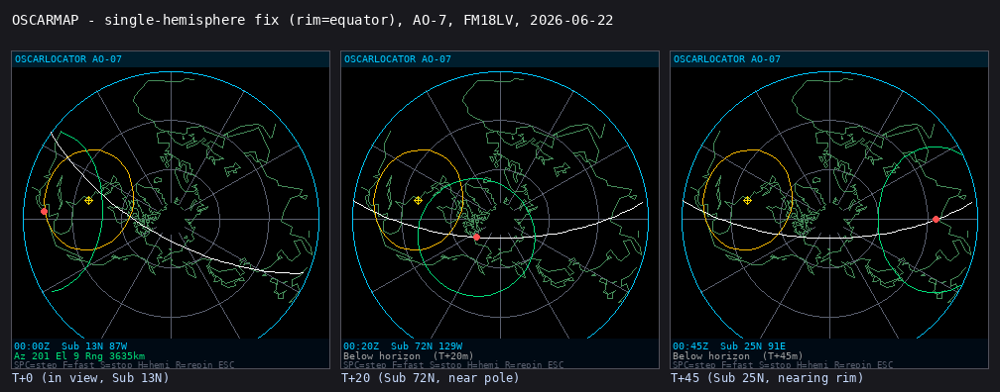
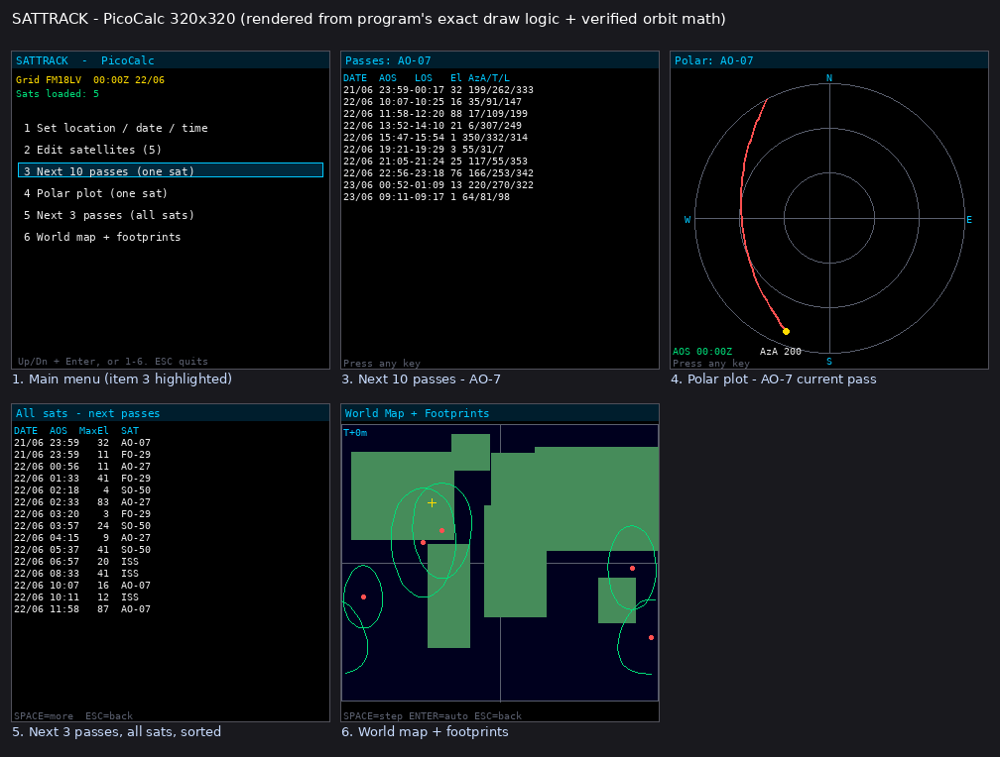
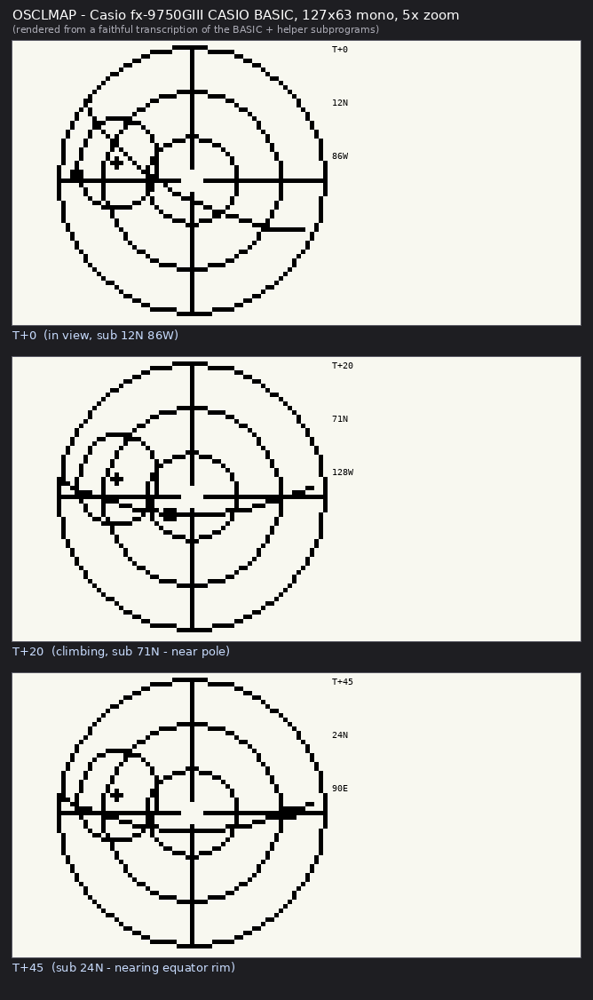
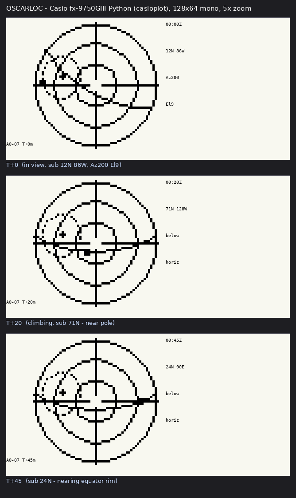
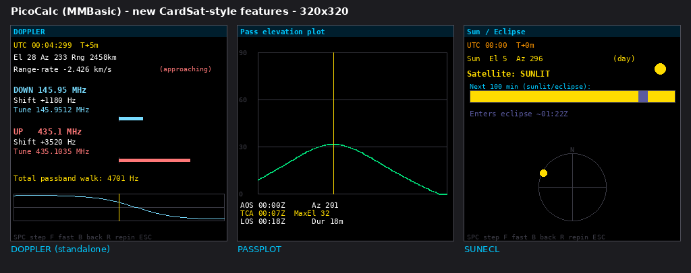
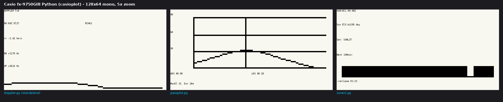
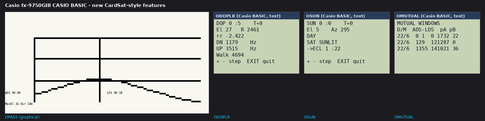

# Screenshots

Example outputs from the two graphical PicoCalc programs, at the device's true
**320×320** resolution.

> **These are renders, not device captures.** They were produced by running each
> program's *exact* drawing logic — the same azimuthal-equidistant projection,
> coordinate math, screen layout, colours, and the same verified secular-J2 orbit
> propagator — through a pixel renderer. They should closely match the PicoCalc,
> but a real device may differ slightly in font metrics and will not anti-alias
> (lines will look a touch more jagged). Text spacing in MMBasic's bitmap font
> may also differ by a pixel or two from the proportional preview font used here.

All examples use the bundled sample satellites and these settings:
- Grid **FM18LV** (~38.9 N, 77.0 W)
- UTC **2026-06-22 00:00**
- Satellite **AO-7** where a single sat is shown

## OSCARMAP — live polar OSCARLOCATOR

Three time steps of the live display. Polar azimuthal-equidistant map centred on
the north pole, with embedded Natural Earth coastlines, lat/lon graticule, cyan
rim, the white equator-crossing-anchored ground track, amber range circle and
yellow **+** QTH marker, green footprint, and the red satellite dot riding the
arc. The bottom read-out shows UTC, sub-point, and Az/El/range (or "below
horizon"). Individual frames: `oscarmap-t0.png`, `oscarmap-t20.png`,
`oscarmap-t45.png`.

## SATTRACK — multi-screen tracker

1. `sattrack-1-menu.png` — main menu (item 3 highlighted), status line.
2. `sattrack-3-next10passes.png` — AO-7 pass table (date, AOS-LOS, max El,
   Az AOS/TCA/LOS). Matches the verified reference: 23:59-00:17 El32, the 88°
   peak at 11:58, etc.
3. `sattrack-4-polarplot.png` — AO-7's current pass as a sky track; amber dot =
   live position, green = AOS.
4. `sattrack-5-allsats-next3.png` — next 3 passes of all five sample sats,
   merged and sorted by time.
5. `sattrack-6-worldmap.png` — equirectangular world (rough continent blocks),
   QTH (yellow +), each satellite's sub-point (red) and footprint (green).

## Regenerating

The renderer used to produce these lives outside the repo (it depends on Python
+ Pillow + the decimated coastline). The point of committing the PNGs is so the
GitHub README can show what the programs look like without a PicoCalc on hand.
To capture *true* device screenshots, run the `.bas` files on a PicoCalc and
photograph the LCD (MMBasic has no screen-grab to file on this hardware).

## Casio fx-9750GIII — OSCARLOCATOR

Live single-hemisphere polar OSCARLOCATOR on the calculator's small monochrome
screen (shown at 5× zoom). Same projection and orbit math as OSCARMAP, but no
footprint and a range circle instead, to suit the tiny display.

CASIO BASIC build (`OSCLMAP` + helper subprograms):

Python build (`oscarloc_map.py`, casioplot):

Both are renders from a faithful transcription of the program logic (the BASIC
version emulates the List-memory contracts and the OSUBPT/PROJ/EQXFIN
subprograms), not photographs of a calculator screen. Individual BASIC frames:
`casio-oscarloc-basic-t0.png`, `-t20.png`, `-t45.png`.

## CardSat-style feature programs (Doppler, PassPlot, Sun/Eclipse, Mutual)

Four planning tools inspired by CardSat, on all three platforms. See
`../FEATURES-CARDSAT.md` for full details. Renders below (not device captures).

PicoCalc (MMBasic), 320x320 — Doppler (standalone), pass elevation plot, Sun/eclipse:

Casio fx-9750GIII Python (casioplot), 128x64 at 5x — doppler.py, passplot.py, sunecl.py:

Casio fx-9750GIII CASIO BASIC — OPASS (graphical) plus the text-mode ODOPLR, OSUN, OMUTUAL:

(The mutual-window finder is text-only on all platforms — there's nothing
inherently graphical about a window table. Doppler and Sun/eclipse are graphical
on the PicoCalc and Casio Python, and text-mode in CASIO BASIC.)
